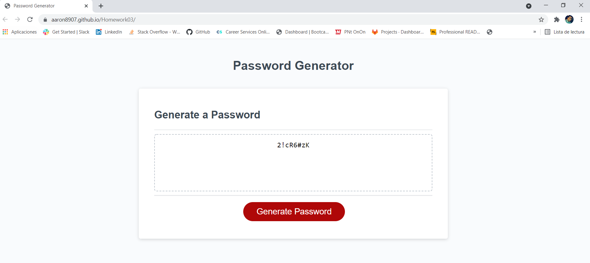

# Password Generator

For this weeks homework I worked on creating a password generator using JavaScript.

## Guide
1) Click on generate password
2) Select minimum length password is required
3) Note at least one of the following criterias must be selected
4) Do you want lowercase letters?
5) Do you want uppercase letters?
6) Do you want numeric characters?
7) Do you want symbols?
8) Copy password and use

Sceenshot of website:

## Links
* https://github.com/Aaron8907/Homework03
* https://aaron8907.github.io/Homework03/
